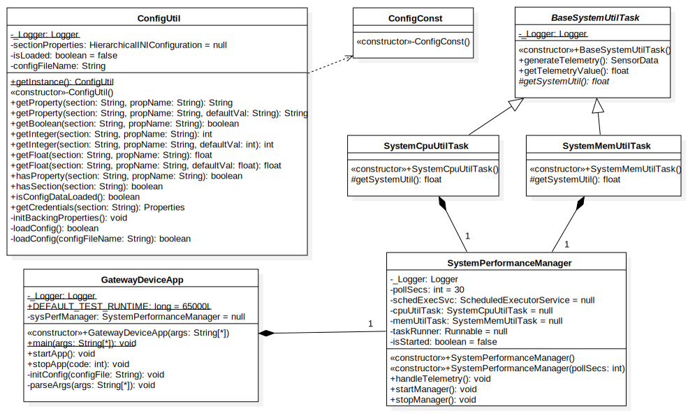

# Gateway Device Application (Connected Devices)

## Lab Module 02

<!-- Be sure to implement all the PIOT-GDA-* issues (requirements) listed at [PIOT-INF-02-001 - Chapter 02](https://github.com/orgs/programming-the-iot/projects/1#column-9974938). -->

### Description

<!-- NOTE: Include two full paragraphs describing your implementation approach by answering the questions listed below. -->

What does your implementation do? 

1. Implement the SystemPerformanceManager
2. Implement SystemCpuUtilTask , SystemMemUtilTask and their base class: BaseSystemUtilTask.
3. Through SystemCpuUtilTask and SystemMemUtilTask, software could get current CPU occupied percentage and current JavaVM Memory used in bytes.
4. Integrate SystemPerformanceManager with Task classes above to manage these tasks: being able to turn on or off cyclically execute these tasks with given rate.
5. Connect SystemPerformanceManager with GatewayDeviceApp, to start the SystemPerformanceManager with GDA.

How does your implementation work?

The SystemPerformanceManager started with GDA, create a scheduler to cyclically(setup by given poll rate) run SystemCpuUtilTask and SystemMemUtilTask to retrieve the measure data of current system CPU and Mem usage data.

### Code Repository and Branch

<!-- NOTE: Be sure to include the branch (e.g. https://github.com/programming-the-iot/python-components/tree/alpha001). -->

URL: https://github.com/NU-CSYE6530-Fall2020/gateway-device-app-Taowyoo

### UML Design Diagram(s)

<!-- NOTE: Include one or more UML designs representing your solution. It's expected each
diagram you provide will look similar to, but not the same as, its counterpart in the
book [Programming the IoT](https://learning.oreilly.com/library/view/programming-the-internet/9781492081401/). -->
The UML for all classes edited so far:

### Unit Tests Executed

<!-- NOTE: TA's will execute your unit tests. You only need to list each test case below
(e.g. ConfigUtilTest, DataUtilTest, etc). Be sure to include all previous tests, too,
since you need to ensure you haven't introduced regressions. -->

- ConfigUtilTest
- SystemCpuUtilTaskTest
- SystemMemUtilTaskTest

### Integration Tests Executed

<!-- NOTE: TA's will execute most of your integration tests using their own environment, with
some exceptions (such as your cloud connectivity tests). In such cases, they'll review
your code to ensure it's correct. As for the tests you execute, you only need to list each
test case below (e.g. SensorSimAdapterManagerTest, DeviceDataManagerTest, etc.) -->

- GatewayDeviceAppTest
- SystemPerformanceManagerTest
