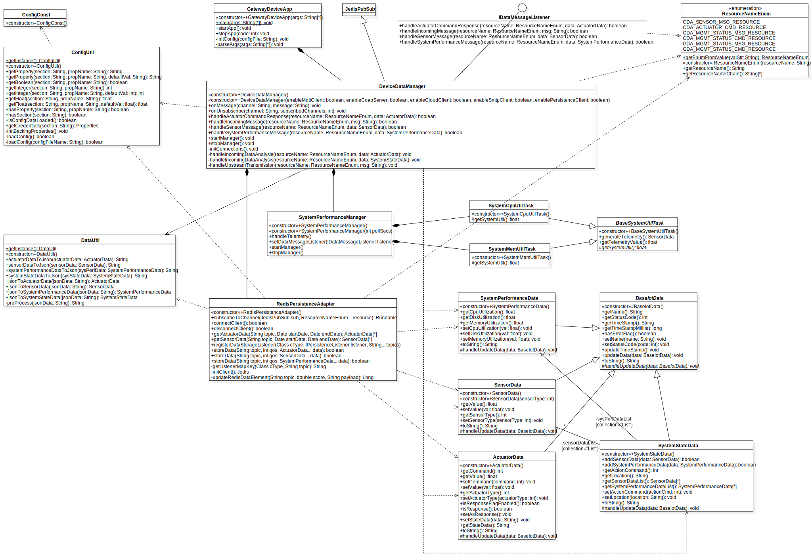

# Gateway Device Application (Connected Devices)

## Lab Module 05

### Description

#### What does your implementation do? 

- Create data containers classes for sensor and actuator data.
- Create a `DataUtil` class to help convert Json string between data instance.
- Finish implementation of `BaseSystemUtilTask` class.
- Implement `RedisPersistenceAdapter` class as a client to communicate with Redis server.
- Implement `PersistenceClientAdapterTest` for testing `RedisPersistenceAdapter`.
- Implement the `DeviceDataManager` class and integrate `RedisPersistenceAdapter` into it.
- Integrate `DeviceDataManager` into `GatewayDeviceApp` class.
- 
#### How does your implementation work?

- Create classes: `SensorData`, `ActuatorData`, `SystemPerformanceData`, `SystemStateData` as data container to hold data send from CDA.
- Use `Gson` to convert Json to java object or convert java object to Json string.
  - Use `toJson()` to convert java object to Json string.
  - Use `fromJson()` to convert Json string to java object.
  - Because, the json string send from CDA by python has some little compatibility problems, Create a `preProcess()` method to pre-process received string:
    - Remove leading and ending extra `"`.
    - Use `StringEscapeUtils.unescapeJava()` to unescape all escape characters.
- Add `SensorData` generation functions on `BaseSystemUtilTask`.
- Use `Jedis` to connect to Redis Server:
  - Create two `Jedis` instance to avoid blocking problems when use a `Jedis` instance to subscribe channels.
  - Use `zadd()`(Redis command: `ZADD`) to store data to Redis by using number of milliseconds of timestamp of each data as score for Redis sorted set.
  - Similarly, use `zrangeByScore()`(Redis command: `ZRANGEBYSCORE`) to got data between `startDate` and `endDate`(java.util.Date), using number of milliseconds of two date as range.
- In regard to `PersistenceClientAdapterTest`:
  - Create customized test data to test `storeData()` methods.
  - To test `getActuatorData()` and `getSensorData()`:
    - First, store data as what I did before when testing `storeData()`.
    - Second, get data array with in date range of [`startDate`, `stopDate`], and then test whether its size is equals to the size of data array just stored.
      *Notes: `startDate` == the date of first data element in data array, `endDate` == the date of last data element in data array.*
- Create `DeviceDataManager` class:
  - Add related start and stop logic.
  - Add config loading logic.
  - Add initialization of `SystemPerformanceManager`, `RedisPersistenceAdapter`.
- Add `DeviceDataManager` instance creation , start and stop logic into `GatewayDeviceApp`.

### Code Repository and Branch

URL: https://github.com/NU-CSYE6530-Fall2020/gateway-device-app-Taowyoo/tree/alpha001 

### UML Design Diagram(s)

The [class diagram](../../doc/uml/Lab05.svg) for all classes edited so far:

### Unit Tests Executed

- src/test/java/programmingtheiot/part02/unit/data/ActuatorDataTest
- src/test/java/programmingtheiot/part02/unit/data/SensorDataTest
- src/test/java/programmingtheiot/part02/unit/data/SystemPerformanceDataTest
- src/test/java/programmingtheiot/part02/unit/data/SystemStateDataTest
- src/test/java/programmingtheiot/part02/unit/data/DataUtilTest
- src/test/java/programmingtheiot/part01/unit/system/SystemCpuUtilTaskTest
- src/test/java/programmingtheiot/part01/unit/system/SystemMemUtilTaskTest

### Integration Tests Executed

- src/test/java/programmingtheiot/part02/integration/data/DataIntegrationTest
- src/test/java/programmingtheiot/part02/integration/connection/PersistenceClientAdapterTest
- src/test/java/programmingtheiot/part02/integration/app/DeviceDataManagerNoCommsTest
- src/test/java/programmingtheiot/part01/integration/app/GatewayDeviceAppTest
