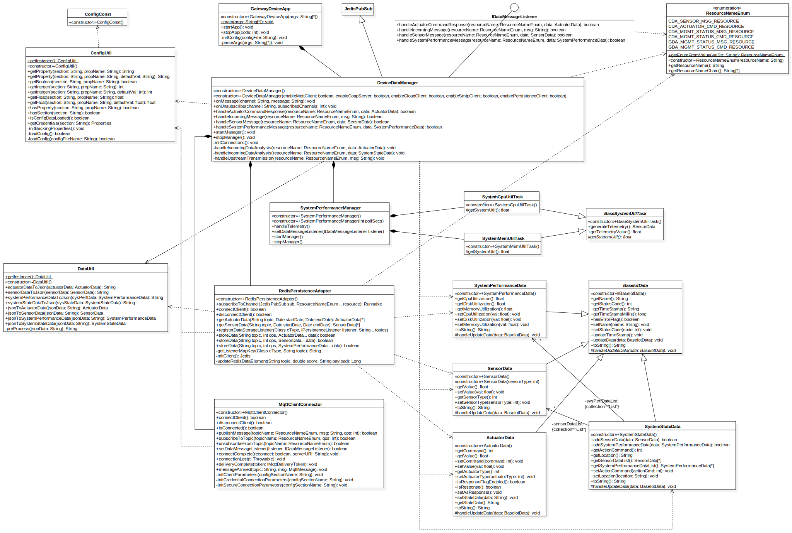

# Gateway Device Application (Connected Devices)

## Lab Module 07

### Description

#### What does your implementation do? 

1. Create `MqttClientConnector` class as a client for GDA to communicate with broker.
2. Integrate `MqttClientConnector` into `DeviceDataManager`.

#### How does your implementation work?

1. Implement `MqttClientConnector` class:
   1. Implement all necessary callback functions for MQTT client.
   2. Implement methods for `IPubSubClient` interface.
2. Add `MqttClientConnector` instance and related logic code in `DeviceDataManager` class:
   1. Add instance initialization, config setup code for `MqttClientConnector`.
   2. Add basic logic of processing incoming `SensorData`, `SystemPerformanceData`, `ActuationData`.

### Code Repository and Branch

URL: https://github.com/NU-CSYE6530-Fall2020/gateway-device-app-Taowyoo/tree/alpha001

### UML Design Diagram(s)

Here is latest class diagram of current code:


### Unit Tests Executed

- All unit tests in part01
- All unit tests in part02

### Integration Tests Executed

-  src\test\java\programmingtheiot\part03\integration\connection\MqttClientConnectorTest

### 14 Types of MQTT Control Packets

#### 1. CONNECT – Client requests a connection to a Server

QoS 0:

```
MQ Telemetry Transport Protocol, Connect Command
    Header Flags: 0x10, Message Type: Connect Command
        0001 .... = Message Type: Connect Command (1)
        .... 0000 = Reserved: 0
    Msg Len: 27
    Protocol Name Length: 4
    Protocol Name: MQTT
    Version: MQTT v3.1.1 (4)
    Connect Flags: 0x02, QoS Level: At most once delivery (Fire and Forget), Clean Session Flag
    Keep Alive: 30
    Client ID Length: 15
    Client ID: paho95620870135
```


#### 2. CONNACK – Acknowledge connection request

No QoS Setting

```
MQ Telemetry Transport Protocol, Connect Ack
    Header Flags: 0x20, Message Type: Connect Ack
        0010 .... = Message Type: Connect Ack (2)
        .... 0000 = Reserved: 0
    Msg Len: 2
    Acknowledge Flags: 0x00
    Return Code: Connection Accepted (0)

```

#### 3. PUBLISH – Publish message

- QoS 1:

   ```
   MQ Telemetry Transport Protocol, Publish Message
      Header Flags: 0x32, Message Type: Publish Message, QoS Level: At least once delivery (Acknowledged deliver)
         0011 .... = Message Type: Publish Message (3)
         .... 0... = DUP Flag: Not set
         .... .01. = QoS Level: At least once delivery (Acknowledged deliver) (1)
         .... ...0 = Retain: Not set
      Msg Len: 70
      Topic Length: 28
      Topic: GDA_MGMT_STATUS_MSG_RESOURCE
      Message Identifier: 2
      Message: TEST: This is the GDA message payload.
   ```

- QoS 2:

   ```
   MQ Telemetry Transport Protocol, Publish Message
      Header Flags: 0x34, Message Type: Publish Message, QoS Level: Exactly once delivery (Assured Delivery)
         0011 .... = Message Type: Publish Message (3)
         .... 0... = DUP Flag: Not set
         .... .10. = QoS Level: Exactly once delivery (Assured Delivery) (2)
         .... ...0 = Retain: Not set
      Msg Len: 70
      Topic Length: 28
      Topic: GDA_MGMT_STATUS_MSG_RESOURCE
      Message Identifier: 2
      Message: TEST: This is the GDA message payload.
   ```

#### 4. PUBACK – Publish acknowledgement

- QoS 1:

   ```
   MQ Telemetry Transport Protocol, Publish Ack
      Header Flags: 0x40, Message Type: Publish Ack
         0100 .... = Message Type: Publish Ack (4)
         .... 0000 = Reserved: 0
      Msg Len: 2
      Message Identifier: 2
   ```

#### 5. PUBREC – Publish received (QoS 2 publish received, part 1)

- QoS 2:

   ```
   MQ Telemetry Transport Protocol, Publish Message
      Header Flags: 0x34, Message Type: Publish Message, QoS Level: Exactly once delivery (Assured Delivery)
         0011 .... = Message Type: Publish Message (3)
         .... 0... = DUP Flag: Not set
         .... .10. = QoS Level: Exactly once delivery (Assured Delivery) (2)
         .... ...0 = Retain: Not set
      Msg Len: 70
      Topic Length: 28
      Topic: GDA_MGMT_STATUS_MSG_RESOURCE
      Message Identifier: 2
      Message: TEST: This is the GDA message payload.
   ```

#### 6. PUBREL – Publish release (QoS 2 publish received, part 2)

- QoS 2:

   ```
   MQ Telemetry Transport Protocol, Publish Release
      Header Flags: 0x62, Message Type: Publish Release
         0110 .... = Message Type: Publish Release (6)
         .... 0010 = Reserved: 2
      Msg Len: 2
      Message Identifier: 2
   ```

#### 7. PUBCOMP – Publish complete (QoS 2 publish received, part 3)

- QoS 2:

   ```
   MQ Telemetry Transport Protocol, Publish Complete
      Header Flags: 0x70, Message Type: Publish Complete
         0111 .... = Message Type: Publish Complete (7)
         .... 0000 = Reserved: 0
      Msg Len: 2
      Message Identifier: 2
   ```

#### 8. SUBSCRIBE - Subscribe to topics

- QoS 1:

   ```
   MQ Telemetry Transport Protocol, Subscribe Request
      Header Flags: 0x82, Message Type: Subscribe Request
         1000 .... = Message Type: Subscribe Request (8)
         .... 0010 = Reserved: 2
      Msg Len: 33
      Message Identifier: 1
      Topic Length: 28
      Topic: GDA_MGMT_STATUS_MSG_RESOURCE
      Requested QoS: At least once delivery (Acknowledged deliver) (1)
   ```

- QoS 2:

   ```
   MQ Telemetry Transport Protocol, Subscribe Request
      Header Flags: 0x82, Message Type: Subscribe Request
         1000 .... = Message Type: Subscribe Request (8)
         .... 0010 = Reserved: 2
      Msg Len: 33
      Message Identifier: 1
      Topic Length: 28
      Topic: GDA_MGMT_STATUS_MSG_RESOURCE
      Requested QoS: Exactly once delivery (Assured Delivery) (2)
   ```

#### 9. SUBACK – Subscribe acknowledgement

- QoS 1:

   ```
   MQ Telemetry Transport Protocol, Subscribe Ack
      Header Flags: 0x90, Message Type: Subscribe Ack
         1001 .... = Message Type: Subscribe Ack (9)
         .... 0000 = Reserved: 0
      Msg Len: 3
      Message Identifier: 1
      Granted QoS: At least once delivery (Acknowledged deliver) (1)
   ```

- QoS 2:

   ```
   MQ Telemetry Transport Protocol, Subscribe Ack
      Header Flags: 0x90, Message Type: Subscribe Ack
         1001 .... = Message Type: Subscribe Ack (9)
         .... 0000 = Reserved: 0
      Msg Len: 3
      Message Identifier: 1
      Granted QoS: Exactly once delivery (Assured Delivery) (2)
   ```

#### 10. UNSUBSCRIBE – Unsubscribe from topics

No QoS Setting

```
MQ Telemetry Transport Protocol, Unsubscribe Request
   Header Flags: 0xa2, Message Type: Unsubscribe Request
      1010 .... = Message Type: Unsubscribe Request (10)
      .... 0010 = Reserved: 2
   Msg Len: 32
   Message Identifier: 3
   Topic Length: 28
   Topic: GDA_MGMT_STATUS_MSG_RESOURCE
```

#### 11. UNSUBACK – Unsubscribe acknowledgement

No QoS Setting

```
MQ Telemetry Transport Protocol, Unsubscribe Ack
   Header Flags: 0xb0, Message Type: Unsubscribe Ack
      1011 .... = Message Type: Unsubscribe Ack (11)
      .... 0000 = Reserved: 0
   Msg Len: 2
   Message Identifier: 3
```


#### 12. PINGREQ – PING request

No QoS Setting

```
MQ Telemetry Transport Protocol, Ping Request
    Header Flags: 0xc0, Message Type: Ping Request
        1100 .... = Message Type: Ping Request (12)
        .... 0000 = Reserved: 0
    Msg Len: 0
```

#### 13. PINGRESP – PING response

No QoS Setting

```
MQ Telemetry Transport Protocol, Ping Response
    Header Flags: 0xd0, Message Type: Ping Response
        1101 .... = Message Type: Ping Response (13)
        .... 0000 = Reserved: 0
    Msg Len: 0
```

#### 14. DISCONNECT – Disconnect notification

No QoS Setting

```
MQ Telemetry Transport Protocol, Disconnect Req
    Header Flags: 0xe0, Message Type: Disconnect Req
        1110 .... = Message Type: Disconnect Req (14)
        .... 0000 = Reserved: 0
    Msg Len: 0
```
