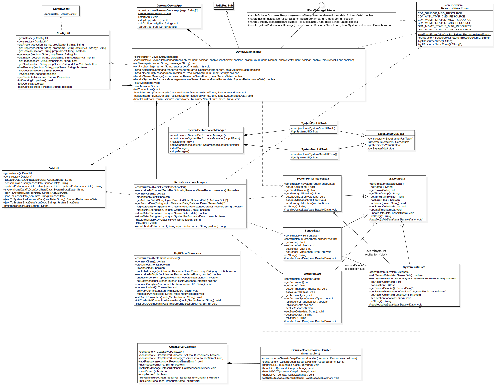

# Gateway Device Application (Connected Devices)

## Lab Module 08

<!-- Be sure to implement all the PIOT-GDA-* issues (requirements) listed at [PIOT-INF-08-001 - Chapter 08](https://github.com/orgs/programming-the-iot/projects/1#column-10488501). -->

### Description

<!-- NOTE: Include two full paragraphs describing your implementation approach by answering the questions listed below. -->

#### What does your implementation do? 

1. Update some code from professor's [repo](https://github.com/programming-the-iot/java-components)
2. Install and configure Californium Tools
3. Create and update two classes: [`CoapServerGateway`](../../src/main/java/programmingtheiot/gda/connection/CoapServerGateway.java), [`GenericCoapResourceHandler`](../../src/main/java/programmingtheiot/gda/connection/handlers/GenericCoapResourceHandler.java)
4. Add log response text in [`CoapServerGatewayTest`](../../src/test/java/programmingtheiot/part03/integration/connection/CoapServerGatewayTest.java)

#### How does your implementation work?

1. Update some template code from original template [repo](https://github.com/programming-the-iot/java-components):
   1. Clone the professor's [repo](https://github.com/programming-the-iot/java-components)
   2. Create a temperate branch `tmp` for merging new codes
   3. Copy those updated parts to my repo
   4. Check and commit updates
2. Install Californium:
   1. Download and compile code:
        ```shell
        git clone https://github.com/eclipse/californium.tools.git
        cd californium.tools
        mvn clean install
        ```
   2. Test compiled Californium CoAP server and client:
      1. Run `java -jar cf-server/target/cf-server-2.5.0-SNAPSHOT.jar` to run CoAP server
      2. Run `java -jar cf-client/target/cf-client-2.5.0-SNAPSHOT.jar -m GET` to test use client to request a GET to server just started
3. Update [`CoapServerGateway`](../../src/main/java/programmingtheiot/gda/connection/CoapServerGateway.java), [`GenericCoapResourceHandler`](../../src/main/java/programmingtheiot/gda/connection/handlers/GenericCoapResourceHandler.java):
   1. Simply update handler fot GET, POST, DELETE, PUT in [`GenericCoapResourceHandler`](../../src/main/java/programmingtheiot/gda/connection/handlers/GenericCoapResourceHandler.java)
   2. Add logic to add resource with composite structure that represents a tree by using [`GenericCoapResourceHandler`](../../src/main/java/programmingtheiot/gda/connection/handlers/GenericCoapResourceHandler.java) in [`CoapServerGateway`](../../src/main/java/programmingtheiot/gda/connection/CoapServerGateway.java)

### Code Repository and Branch

URL: https://github.com/NU-CSYE6530-Fall2020/gateway-device-app-Taowyoo/tree/alpha001

### UML Design Diagram(s)

Here is latest class diagram of current code:


### Unit Tests Executed

- All unit tests in part01
- All unit tests in part02

### Integration Tests Executed

- **/part02/integration/connection/PersistenceClientAdapterTest.java
- **/part03/integration/connection/MqttClientConnectorTest.java
- **/part03/integration/connection/CoapServerGatewayTest.java
- **/part02/integration/app/DeviceDataManagerNoCommsTest.java
- **/part01/integration/app/GatewayDeviceAppTest.java