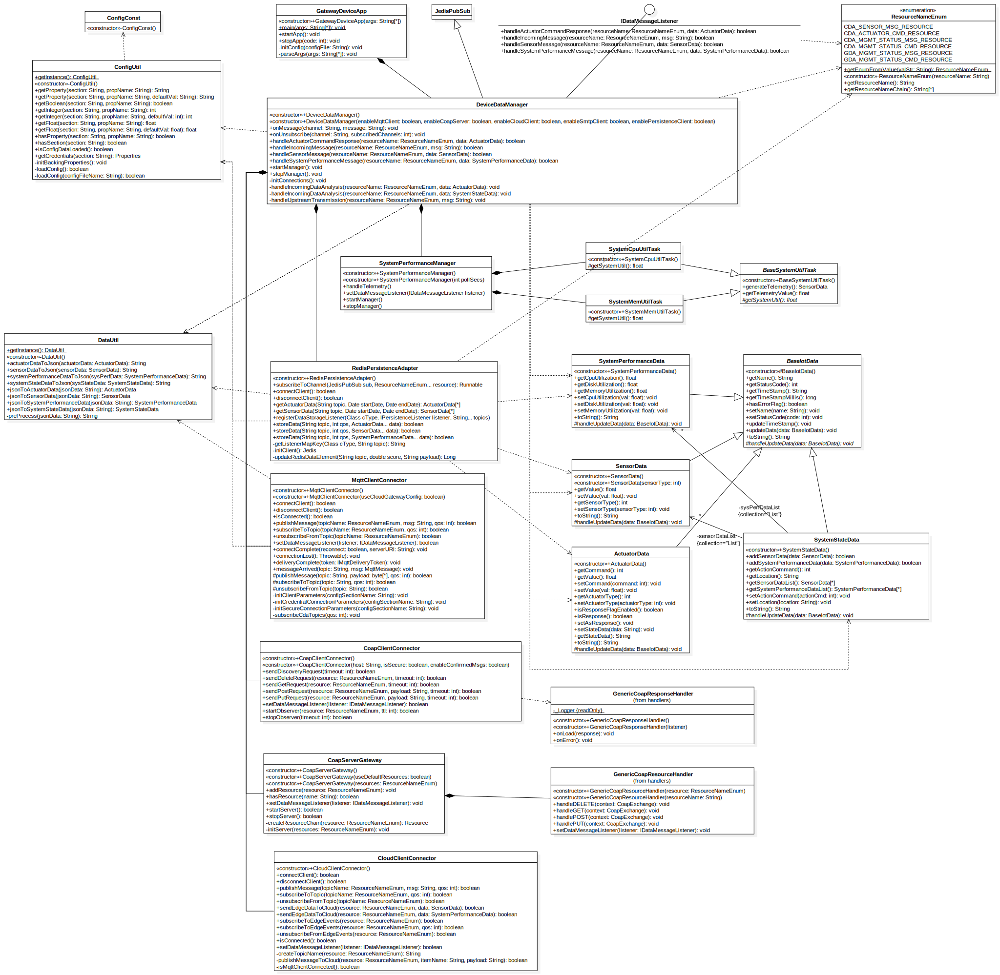
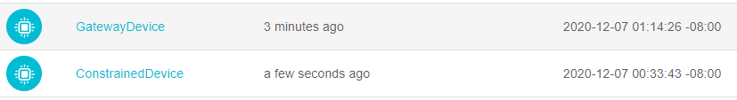
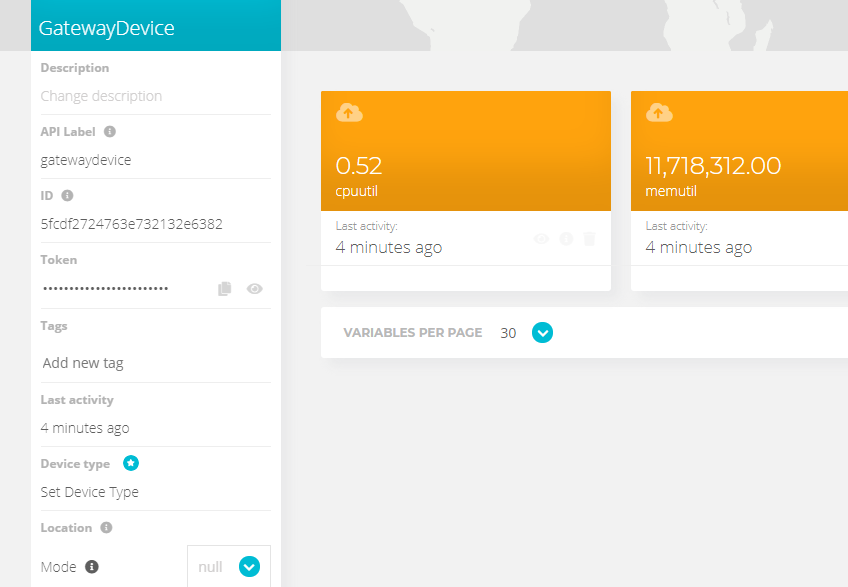
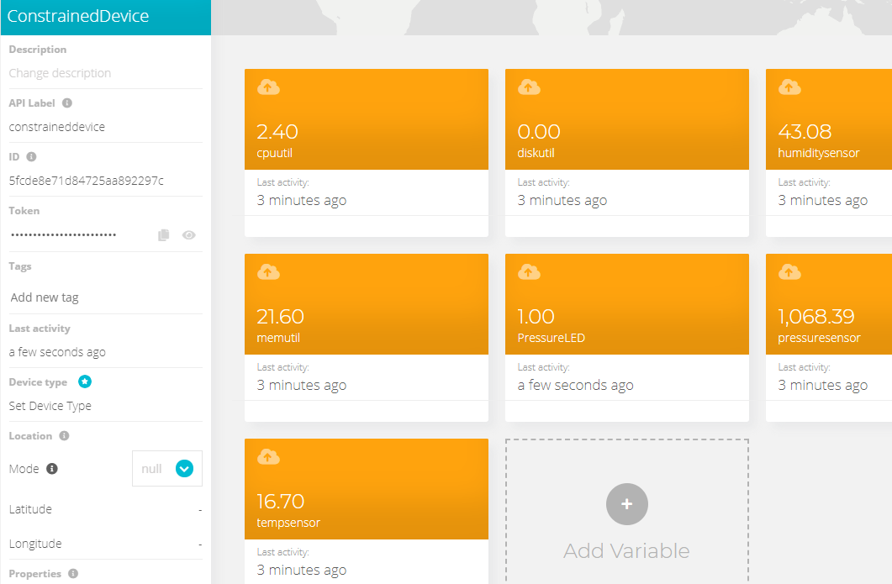
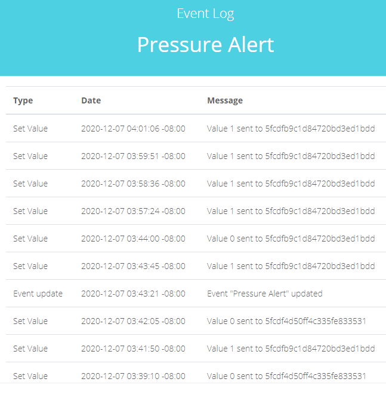
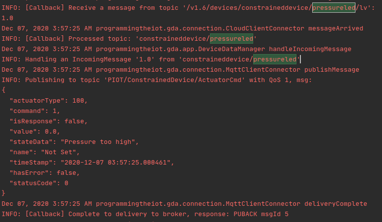
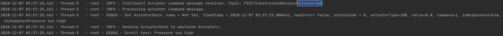

# Gateway Device Application (Connected Devices)

## Lab Module 11

### Description

What does your implementation do? 

1. Setup Ubidots acount, cert, tokens and read related docs
2. Update the `MqttClientConnector` with additional features
3. Create `CloudMqttClientConnector` and `ICloudClient` interface
4. Add features for the GDA communicate with Cloud.

How does your implementation work?

1. Download Ubidots' root cert and my tokens
2. Extract `IPubSubClient` interface functions so as let `MqttClientConnector` could been better extended.
3. Create `CloudMqttClientConnector` with instance a `MqttClientConnector` in it and add some specific ubidots topic naming conversion.
4. Add features for Cloud - GDA communication:
   1. Add upstreaming for all CDA and GDA `SensorData` and `SystemPerformanceData`
   2. Add an actuation event on the cloud

### Code Repository and Branch

URL: https://github.com/NU-CSYE6530-Fall2020/gateway-device-app-Taowyoo/tree/alpha001

### UML Design Diagram(s)

Here is latest class diagram of current code:

### Unit Tests Executed

- No tests 

### Integration Tests Executed

- MqttClientConnectorTest
- CloudClientConnectorTest
- DeviceDataManagerIntegrationTest

### Test Record:

#### Ubidots Devices and data:

#### Ubidots Event :

#### Data Flow:

Cloud topic value -> GDA -> CDA -> Emulator

