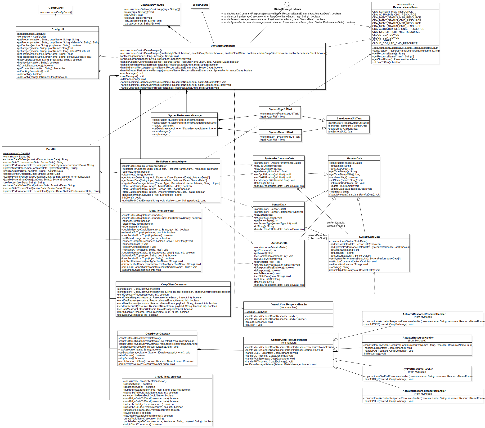

# Gateway Device Application (Connected Devices)

## Lab Module 12 - Semester Project - GDA Components

<!-- Be sure to implement all the PIOT-GDA-* issues (requirements) listed at [PIOT-INF-11-001 - Chapter 11](https://github.com/orgs/programming-the-iot/projects/1#column-10488514). -->

### Description

<!-- NOTE: Include two full paragraphs describing your implementation approach by answering the questions listed below. -->

What does your implementation do? 

1. Add feature of upstreamming Actuator response which has error to cloud
2. Update CoAP server
3. Add CO2 cloud topic
4. Improve logging for Redis

How does your implementation work?

1. Add functions on `DeviceDataManager` to handle `ActuatorData` error response, and upstream them to cloud
2. Add some CoAP resource handler class to handle POST request from client
3. Add functions to store all added end resource handler
4. Change original cloud pressure led trigger topic to CO2 led trigger topic
5. Add functions of wrapping Actuation data to Ubidots specific format in `DataUtil`

### Code Repository and Branch

<!-- NOTE: Be sure to include the branch (e.g. https://github.com/programming-the-iot/python-components/tree/alpha001). -->

URL: https://github.com/NU-CSYE6530-Fall2020/gateway-device-app-Taowyoo/tree/alpha001

### UML Design Diagram(s)

<!-- NOTE: Include one or more UML designs representing your solution. It's expected each
diagram you provide will look similar to, but not the same as, its counterpart in the
book [Programming the IoT](https://learning.oreilly.com/library/view/programming-the-internet/9781492081401/). -->

Here is latest class diagram of GDA codes:

### Unit Tests Executed

- All unit tests in part 01 and part 02

### Integration Tests Executed

- CoapServerGatewayTest
- GatewayDeviceAppTest
